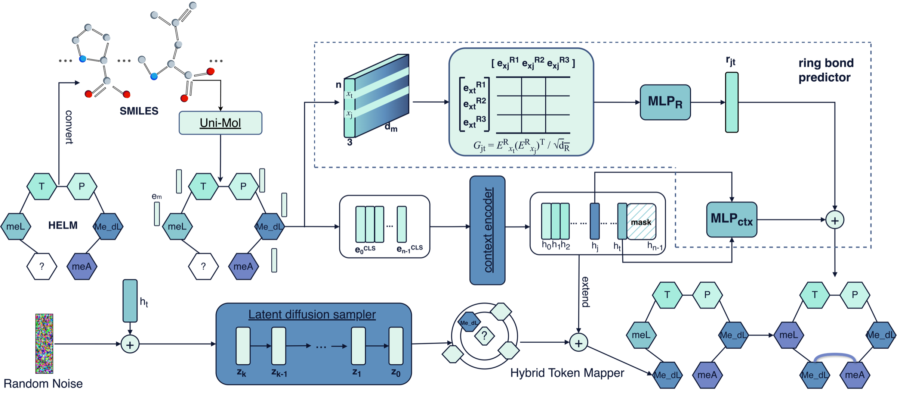
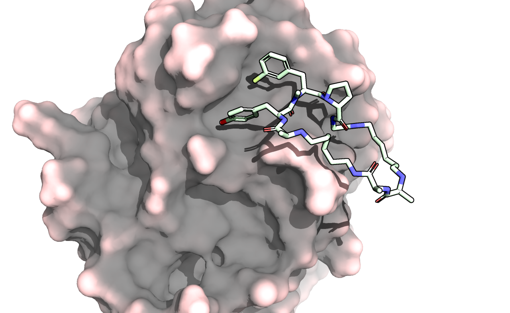
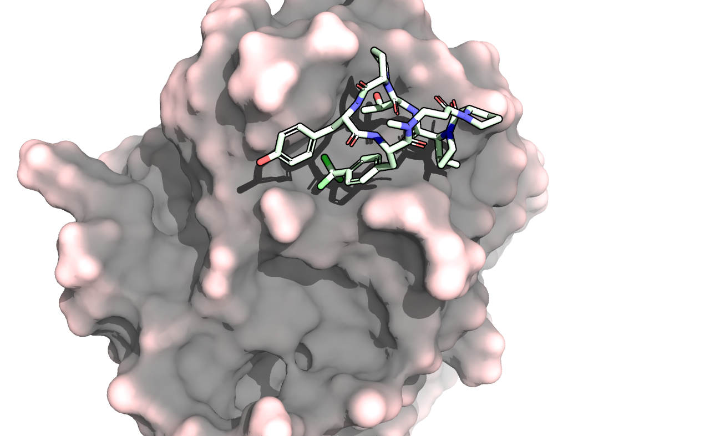
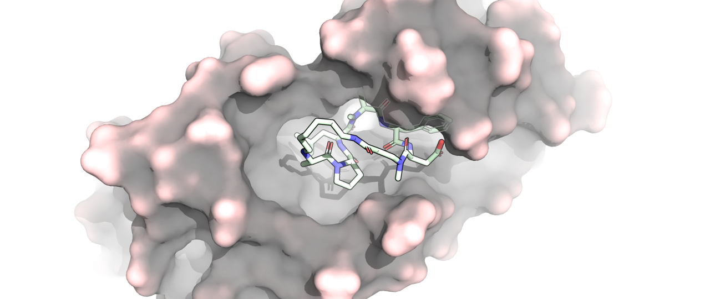
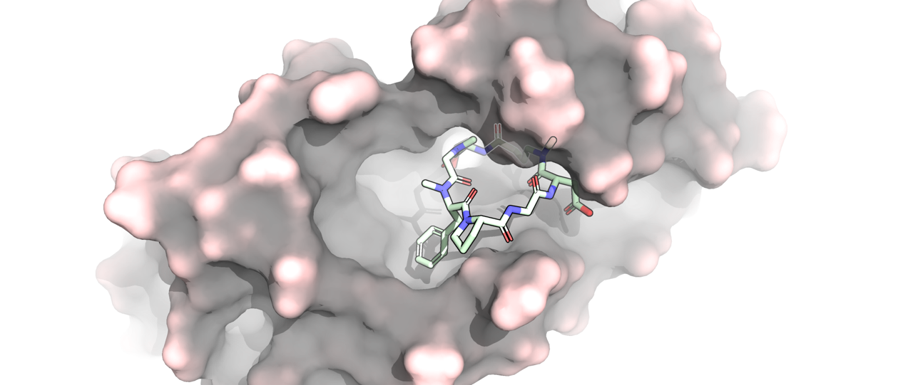

# PepALD

**Autoregressive latent diffusion for HELM-based macrocyclic peptide generation.**

[](https://arxiv.org/abs/2606.14510)

PepALD, implemented in this repository as `pepar_diff`, is a research codebase for
de novo macrocyclic peptide design with non-natural monomers, explicit HELM
connectivity, and target-aware optimization. The framework combines HELM
sequence modeling, Uni-Mol-derived monomer embeddings, autoregressive diffusion
in a chemically informed latent space, R-group-aware ring prediction, and
preference optimization driven by docking and permeability-related rewards.

This repository accompanies the arXiv preprint
[PepALD: Macrocyclic Peptide Generation via Autoregressive Latent Diffusion](https://arxiv.org/abs/2606.14510).
It is organized as a reproducible AI4Science / bioinformatics research codebase
rather than a packaged production service.

## Overview

Macrocyclic peptides are attractive therapeutic scaffolds for difficult targets
such as protein-protein interfaces and intracellular proteins. Their design,
however, requires simultaneous control over sequence composition, non-natural
monomer chemistry, cyclization topology, membrane permeability, solubility, and
target binding.

PepALD addresses this setting by operating at the HELM monomer level while
retaining molecular information through Uni-Mol embeddings. At each
autoregressive step, the model samples the next monomer in continuous chemical
latent space, maps it back to an admissible HELM token, and predicts possible
ring-closure bonds through R-group compatibility. The model can then be aligned
to downstream objectives using winner-protected diffusion-adapted direct
preference optimization (WP-DPO).

## Key Features

- HELM-native peptide generation with explicit support for macrocyclic
  connectivity.
- Uni-Mol-based monomer embeddings containing molecule-level and R-group-site
  representations.
- Autoregressive latent diffusion (ALD) over monomer embeddings rather than
  atom-level SMILES strings.
- Causal context encoder and context-conditioned denoising network.
- R-group-aware ring-bond predictor for autoregressive macrocyclization.
- Hybrid token mapping that combines embedding-space proximity with an
  auxiliary language-model prior.
- Supervised pretraining, cyclic fine-tuning, permeability-oriented
  fine-tuning, and DPO-style target optimization.
- Uni-Dock/Vina scoring pipeline for structure-aware reward construction.
- Separate permeability environment for compatibility with the random-forest
  permeability predictor used in the study.

## Method Overview

PepALD represents each HELM monomer `m` by a structured embedding

```text
e_m = [e_CLS, e_R1, e_R2, e_R3]
```

where `e_CLS` is a molecule-level Uni-Mol representation and `e_Ri` denotes the
representation at the atom adjacent to the corresponding HELM R-group attachment
site. Missing R-groups are represented by zero vectors.

The generator contains three coupled modules:

1. **Causal context encoder**  
   A causal Transformer summarizes the already generated prefix and produces
   the context vector used to generate the next residue.

2. **Context-conditioned diffusion engine**  
   A denoiser samples the next monomer embedding through DDPM/DDIM-style reverse
   diffusion in the frozen Uni-Mol latent space.

3. **Ring-bond predictor and token mapper**  
   The continuous sample is mapped to a valid HELM monomer under position and
   R-group constraints. In parallel, the ring predictor scores whether the new
   residue should form a ring closure with a previous residue and classifies the
   R-group link type.

For downstream optimization, generated candidates are scored with target
rewards such as Uni-Dock/Vina docking scores. Preference pairs are constructed
from reward-ranked candidate pools and used in a diffusion-adapted DPO objective
with an additional winner-protection term.

## Paper Figures

### PepALD Framework



The full PepALD workflow combines HELM grammar and a curated monomer codebook,
Uni-Mol structured monomer embeddings, autoregressive latent diffusion, hybrid
token mapping, R-group-aware ring prediction, and WP-DPO reward alignment for
target-specific macrocyclic peptide optimization.

### Representative Generated 3D Structures

These docking visualizations show four representative PepALD-generated
macrocyclic peptides selected from the target-specific optimization case
studies in the paper.

| Targeted case | Targeted case |
| --- | --- |
| **SPSB2 / 6DN5** | **SPSB2 / 6DN5** |
|  |  |
| **SPSB2-CP1**<br>Vina score: -8.436<br>Permeability: -6.300<br>Solubility: 0.851<br>`PEPTIDE1{A.Mono84.Y.Me_Phe(3-Cl).dP.G.Mono84}` | **SPSB2-CP2**<br>Vina score: -8.256<br>Permeability: -6.576<br>Solubility: 0.839<br>`PEPTIDE1{Me_Bal.P.Mono2.T.P.Y.Phe(4-CF3)}` |
| **MtbCM / 9BT3** | **MtbCM / 9BT3** |
|  |  |
| **MtbCM-CP1**<br>Vina score: -11.067<br>Permeability: -5.936<br>Solubility: 0.794<br>`PEPTIDE1{Me_Bal.Mono84.P.L.meA.dF.D}` | **MtbCM-CP2**<br>Vina score: -10.034<br>Permeability: -5.617<br>Solubility: 0.834<br>`PEPTIDE1{Mono6.T.Sar.meF.P.G.D}` |

## Repository Structure

```text
pepar_diff/                         Core Python package
  core/                             Attention, embeddings, feed-forward layers
  diffusion/                        Noise schedules, denoiser, DDPM/DDIM engine
  models/                           Context encoder, ALD model, token mapper, ring predictor
  data/                             HELM datasets and topology utilities
  dpo/                              DPO datasets, loss functions, candidate utilities
  embeddings/                       Uni-Mol embedding generation helpers
  evaluation/                       Permeability and solubility scoring utilities
  postprocess/                      HELM cyclization post-processing
  utils/                            HELM parsing and metric helpers
  vina/                             Uni-Dock/Vina docking backend

scripts/
  data/prepare/                     Dataset extraction and preprocessing scripts
  train/                            Pretraining, fine-tuning, DPO, multi-round DPO
  generate/                         Single- and multi-GPU generation scripts
  eval/                             Vina, permeability, solubility, validity, and full metrics
  eval_reference_model/             Reference-model evaluation scripts
  analysis/                         Dataset and embedding analysis utilities
  setup/                            Uni-Dock installation helper

configs/
  training/                         Training, fine-tuning, and DPO JSON configs
  inference/                        Case-specific generation/evaluation configs

data/
  raw/                              Raw ChEMBL32 and CycPeptMPDB tables
  processed/                        HELM corpora, vocabulary, monomer library
  docking/                          SPSB2 / 6DN5 docking assets
  docking_9bt3/                     MtbCM / 9BT3 docking assets

envs/                               Conda environment definitions
docs/                               Additional technical notes
```

Generated outputs, checkpoints, paper submission packages, Uni-Mol embedding
caches, and reference-model score caches are intentionally excluded from version
control. They should be regenerated or downloaded separately.

## Installation

The project uses two conda environments. The main environment is used for model
training, generation, most evaluation scripts, and docking-related workflows.
The permeability environment isolates the legacy dependency stack required by
the permeability predictor.

```bash
conda env create -f envs/pepardiff.yml
conda activate pepardiff
pip install -e .
```

For permeability scoring:

```bash
conda env create -f envs/pepardiff-perm.yml
conda activate pepardiff-perm
pip install -e .
```

If the environments already exist:

```bash
conda env update -f envs/pepardiff.yml --prune
conda env update -f envs/pepardiff-perm.yml --prune
```

### Uni-Dock

Target-specific docking workflows use Uni-Dock. The maintained docking path
requires Linux with an NVIDIA GPU.

```bash
conda activate pepardiff
bash scripts/setup/setup_unidock_linux.sh pepardiff
```

See [docs/unidock_gpu_setup.md](docs/unidock_gpu_setup.md) for details.

## Data Preparation

The repository contains preprocessing scripts for the ChEMBL32 and CycPeptMPDB
HELM corpora used by the study. Run commands from the repository root.

```bash
conda activate pepardiff

python scripts/data/prepare/prepare_chembl32_data.py
python scripts/data/prepare/prepare_cycpeptmpdb_data.py
python scripts/data/prepare/prepare_mergeCyclic.py
python scripts/data/prepare/prepare_prior_data.py
```

Expected processed files include:

```text
data/processed/helm_sequences_chembl32.txt
data/processed/helm_sequences_cycpeptmpdb.txt
data/processed/helm_sequences_cyclic.txt
data/processed/helm_sequences_prior.txt
data/processed/helm_vocab.json
data/processed/helm_vocab_reverse.json
data/processed/monomer_library.csv
```

### Uni-Mol Monomer Embeddings

Training and generation expect precomputed monomer embeddings under:

```text
data/processed/unimol_embeddings/
```

This directory is ignored because it is a generated cache. Regenerate it from
the included monomer library with:

```bash
conda activate pepardiff
python -m pepar_diff.embeddings.generator
```

The generator reads `data/processed/monomer_library.csv`, uses
`unimol_tools.UniMolRepr` to compute Uni-Mol representations, and writes the
embedding cache back to `data/processed/unimol_embeddings/`.

### Auxiliary Predictors

The permeability workflow expects a random-forest model at:

```text
data/models/permeability/regression_rf.pkl
```

This predictor is included in the repository, so no extra setup is required for
permeability scoring after cloning the project.

## Training

All model and training hyperparameters are controlled by JSON files in
`configs/training/`. The configs use repository-relative checkpoint placeholders
under `./checkpoints/`. Before running them on a new system, update
`training.checkpoint_dir`, `training.pretrained_checkpoint`, and
`generation.checkpoint_path` as appropriate.

### 1. ChEMBL32 Pretraining

```bash
conda activate pepardiff
python scripts/train/train_pretrain.py
```

Default config:

```text
configs/training/pretrain.json
```

### 2. Macrocyclic Fine-Tuning

```bash
conda activate pepardiff
python scripts/train/train_finetune.py \
  --config configs/training/finetune_cyclic.json
```

This stage enables the ring-bond objective and fine-tunes the ALD generator on
cyclic HELM sequences.

### 3. Permeability-Oriented Fine-Tuning

```bash
conda activate pepardiff
python scripts/train/train_finetune.py \
  --config configs/training/finetune_permeability_top1000.json
```

This config is used for the permeability-enriched prior described in the paper.

### 4. DPO / WP-DPO Optimization

Single-round DPO training:

```bash
conda activate pepardiff
python scripts/train/train_dpo.py \
  --config configs/training/dpo.json
```

Automated multi-round optimization:

```bash
conda activate pepardiff
python scripts/train/run_dpo_rounds.py \
  --config configs/training/dpo.json
```

Related target configs:

```text
configs/training/dpo.json             # SPSB2 / 6DN5 case
configs/training/dpo_case2.json       # MtbCM / 9BT3 case
configs/inference/generate_case1.json # SPSB2 / 6DN5 case
configs/inference/generate_case2.json # MtbCM / 9BT3 case
```

## Inference / Generation

Generated HELM sequences are written to `outputs/`, which is ignored by Git.
Ensure that `generation.checkpoint_path` in the selected config points to a
valid local checkpoint.

Generate from the default pretrained config:

```bash
conda activate pepardiff
python scripts/generate/generate_peptides.py \
  --mode linear \
  --num_samples 100 \
  --output outputs/samples/example_linear.txt
```

Generate from the cyclic fine-tuned config:

```bash
python scripts/generate/generate_peptides.py \
  --mode cyclic \
  --num_samples 100 \
  --output outputs/samples/example_cyclic.txt
```

Generate from an explicit config:

```bash
python scripts/generate/generate_peptides.py \
  --config configs/inference/generate_case1.json \
  --num_samples 100 \
  --output outputs/samples/case1/generated/example.txt
```

Multi-GPU generation is available through:

```bash
python scripts/generate/generate_peptides_multigpu.py \
  --config configs/inference/generate_case1.json \
  --num_samples 1000 \
  --output outputs/samples/case1/generated/example_multigpu.txt \
  --gpu_ids 0,1
```

Adjust `--gpu_ids` to match the available hardware.

## Evaluation

### Validity, Diversity, and Full Metrics

```bash
conda activate pepardiff

python - <<'PY'
from scripts.eval.evaluate_validity_uniqueness import evaluate_validity
evaluate_validity("outputs/samples/example_cyclic.txt")
PY

python scripts/eval/evaluate_full_metrics.py \
  --input outputs/samples/example_cyclic.txt \
  --prior_path data/processed/prior_data.csv
```

### Permeability

Use the dedicated permeability environment:

```bash
conda activate pepardiff-perm

python scripts/eval/evaluate_permeability_scores.py \
  --input outputs/samples/example_cyclic.txt \
  --output outputs/samples/example_cyclic.permeability.csv \
  --mode cyc
```

### Solubility

```bash
conda activate pepardiff

python scripts/eval/evaluate_solubility_scores.py \
  --input outputs/samples/example_cyclic.txt \
  --output outputs/samples/example_cyclic.solubility.csv
```

The solubility scorer mirrors the PepTune scoring path and may download
optional PepTune assets from Hugging Face if local paths are not provided.

### Docking / Vina Scoring

```bash
conda activate pepardiff

python scripts/eval/export_train_vina_scores.py \
  --config configs/training/dpo.json \
  --sample_file outputs/samples/example_cyclic.txt \
  --vina_score_file outputs/samples/example_cyclic.vina.csv \
  --docking_mode flexible
```

To generate samples from one or more checkpoints, enforce head-tail
cyclization, and export Vina scores:

```bash
python scripts/eval/evaluate_checkpoint_vina.py \
  --config configs/inference/generate_case1.json
```

## Reproducing Main Experiments

The main experimental workflow in the study is:

1. Extract HELM corpora from ChEMBL32 and CycPeptMPDB.
2. Build or download the monomer vocabulary and Uni-Mol monomer embeddings.
3. Pretrain PepALD on ChEMBL32 HELM sequences.
4. Fine-tune on cyclic peptide sequences from CycPeptMPDB.
5. Fine-tune a permeability-enriched prior on the top permeability-ranked
   subset.
6. Run WP-DPO with Uni-Dock/Vina rewards for the target-specific cases.
7. Evaluate generated candidates for validity, diversity, novelty, SNN,
   permeability, solubility, and docking score.

Representative commands are:

```bash
python scripts/train/train_pretrain.py

python scripts/train/train_finetune.py \
  --config configs/training/finetune_cyclic.json

python scripts/train/train_finetune.py \
  --config configs/training/finetune_permeability_top1000.json

python scripts/train/run_dpo_rounds.py \
  --config configs/training/dpo.json
```

The exact checkpoints used in the paper are not included in the current Git
repository. Release links for pretrained, cyclic fine-tuned,
permeability-enriched, and target-optimized checkpoints are coming soon.

## Checkpoints and Large Artifacts

The following artifacts are intentionally not tracked by Git:

```text
outputs/
checkpoints/
data/processed/unimol_embeddings/
data/models/
scripts/eval_reference_model/peptune_data/
scripts/eval_reference_model/peptune_samples/
```

Use GitHub Releases, institutional storage, Hugging Face, Zenodo, or another
artifact store for these files.

Recommended checkpoint locations after download:

```text
checkpoints/pretrain/
checkpoints/finetune_cyclic/
checkpoints/finetune_permeability/
checkpoints/dpo/
```

After placing checkpoints, update the corresponding JSON config paths before
running generation or evaluation.

## Citation

If you use this codebase, please cite the associated paper:

```bibtex
@misc{zhang2026pepald,
  title = {PepALD: Macrocyclic Peptide Generation via Autoregressive Latent Diffusion},
  author = {Zhang, Junming and Yi, Siyu and Ju, Wei and Gu, Zhonghui},
  year = {2026},
  eprint = {2606.14510},
  archivePrefix = {arXiv},
  primaryClass = {cs.LG},
  doi = {10.48550/arXiv.2606.14510},
  url = {https://arxiv.org/abs/2606.14510}
}
```

## License

[TODO: add license information and a LICENSE file.]

## Contact

For questions about the code or the accompanying paper, please contact:

```text
btab605@gmail.com
```
